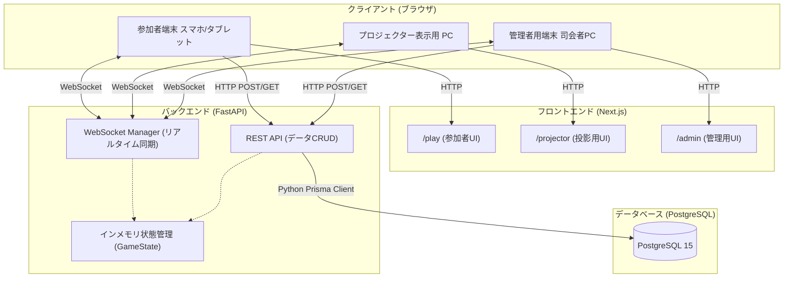

# アーキテクチャ設計書

## 1. システム全体概要
本システム「Hobo Reunion Quiz」は、リアルタイム性を重視したクイズ大会システムです。
単一の進行管理者（司会）の操作により、プロジェクター（全体スクリーン）および各チームの端末（参加者デバイス）が即座に同期し、画面遷移やクイズの採点が行われる構成になっています。

これらを実現するため、フロントエンド・バックエンドを分離したモダンなWebアプリケーションアーキテクチャを採用しています。

## 2. システム構成図

## 3. レイヤー別設計方針

### 3.1. フロントエンド層 (Next.js App Router)
- **SSG / Client Componentsの使い分け**:
  UIのインタラクション（ボタンクリック、WebSocket通信、タイマー計測）が主であるため、主要な画面（`/play`, `/admin`, `/projector`）は `"use client"` ディレクティブを使用した Client Components として実装しています。
- **レスポンシブデザイン**:
   - 参加者画面: モバイルファースト設計（大きなボタン、限られた画面領域の活用）
   - プロジェクター画面: 1080p以上の大画面を前提としたフルスクリーン設計、アニメーション（Tailwind CSS活用）
   - 管理者画面: PCでの操作を前提としたダッシュボード型設計

### 3.2. バックエンド層 (FastAPI)
- **非同期処理 (Async/Await)**:
  Prisma Client Python および WebSocket による同時多発的なリクエストに対応するため、完全非同期（`async def`）でエンドポイントを構成しています。
- **ステート管理 (quiz_state.py)**:
  「現在出題中の問題ID」や「フェーズ（待機中、解答中、発表）」は、PostgreSQLを通さずFastAPIのインメモリ（`pydantic BaseModel`）で保持します。これにより、ミリ秒単位のアクセスに対するレイテンシを極限まで下げています。

### 3.3. データベース層 (PostgreSQL)
- 永続化が必要なデータ（チーム情報、問題マスター、解答のログ、スコア結果）を管理します。
- ORMに `Prisma` を採用し、型安全なデータベースアクセスを実現しています。

## 4. 想定されるデプロイメント環境 (本番想定)
- **Frontend**: Vercel (Next.jsの最適化ホスティング)
- **Backend**: Render.com または AWS App Runner (WebSocket接続を安定して維持できるPaaS環境)
- **Database**: Supabase または Render Managed PostgreSQL