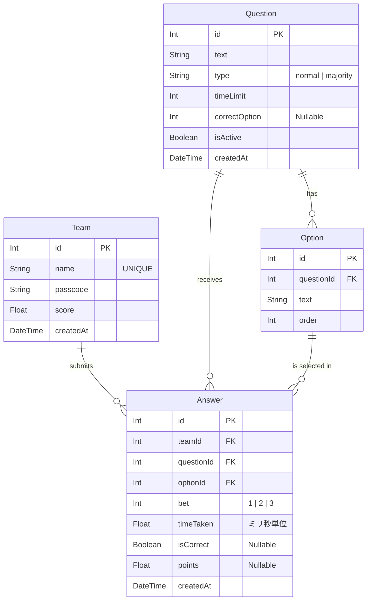

# データベース設計書 (ER図・テーブル定義)

本システムは、PrismaをORMとして使用し、PostgreSQLデータベースにて構成されます。

## 1. ER図

## 2. テーブル（モデル）詳細

### 2.1. `Team` モデル
参加するチームの情報を保持します。ログインの役割も果たします。

| カラム名 | 型 | 制約 | 説明 |
| :--- | :--- | :--- | :--- |
| `id` | Int | PK | 一意のID |
| `name` | String | UNIQUE | チーム名 (例: Aチーム) |
| `passcode`| String | | ログインに利用するパスコード |
| `score` | Float | 初期値: 0 | チームの最新の累計ポイント |
| `createdAt`| DateTime| デフォルト: now| レコード作成日時 |

### 2.2. `Question` モデル
クイズ問題のマスターデータです。

| カラム名 | 型 | 制約 | 説明 |
| :--- | :--- | :--- | :--- |
| `id` | Int | PK | 一意の問題ID |
| `text` | String | | クイズの問題文 |
| `type` | String | | `"normal"` または `"majority"` |
| `timeLimit`| Int | 初期値: 30 | 解答期限（秒） |
| `correctOption`| Int | Nullable | 通常問題の場合の正解となるOptionの順番(`order`の数値など) |
| `isActive` | Boolean | 初期値: false | 現在アクティブかどうか（管理画面用フラグ等）|

### 2.3. `Option` モデル
問題に紐づく選択肢（A〜D）のマスターデータです。

| カラム名 | 型 | 制約 | 説明 |
| :--- | :--- | :--- | :--- |
| `id` | Int | PK | 一意の選択肢ID |
| `questionId`| Int | FK | 紐づく問題ID |
| `text` | String | | 選択肢のテキスト文 |
| `order` | Int | | 表示順序（1:A, 2:B, 3:C, 4:D） |

### 2.4. `Answer` モデル
各チームが各問題に対して送信した解答の行動履歴（トランザクションデータ）です。

| カラム名 | 型 | 制約 | 説明 |
| :--- | :--- | :--- | :--- |
| `id` | Int | PK | 一意の解答ID |
| `teamId` | Int | FK | 解答したチームID |
| `questionId`| Int | FK | 対象の問題ID |
| `optionId`| Int | FK | 選んだ選択肢ID |
| `bet` | Int | | 掛けた倍率 (1, 2, or 3) |
| `timeTaken`| Float | | 問題開示から解答ボタンを押すまでの秒数 |
| `isCorrect`| Boolean | Nullable | 結果発表時に正解/不正解だったかが格納される |
| `points` | Float | Nullable | 結果発表時にその解答によって変動した獲得ポイント |